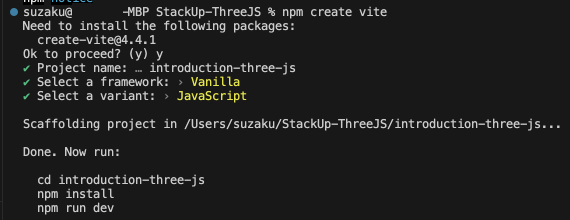
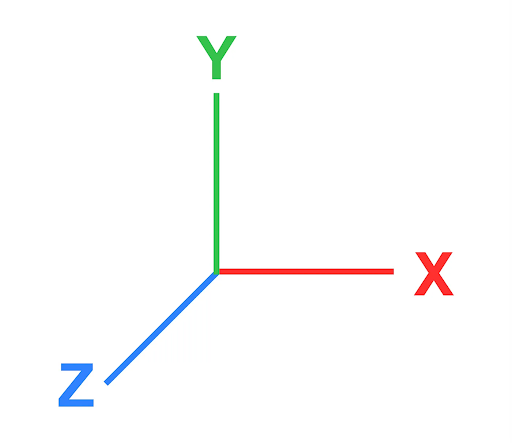
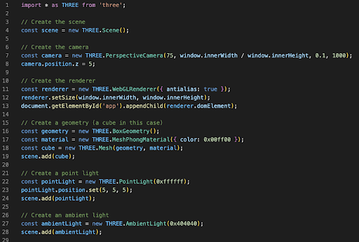
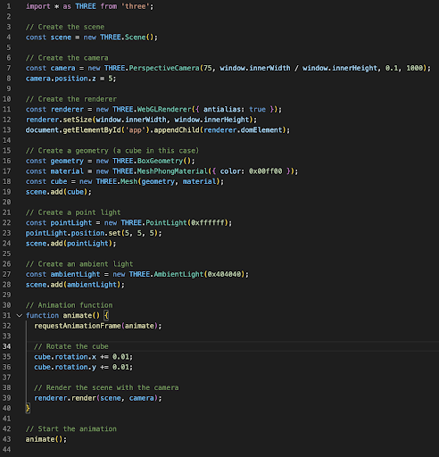

# Introducción a ThreeJS

¿Sabías que podemos crear, ver e interactuar con nuestro propio entorno 3D en nuestro navegador web? Con ThreeJS, ahora podemos hacer eso.

ThreeJS es una de las varias bibliotecas de JavaScript que le permite crear un entorno 3D sin problemas. ThreeJS se basa en la tecnología central de HTML, CSS y JavaScript. Cuando se creó la web por primera vez, estaba destinada a admitir solo imágenes, seguidas de videos. Ahora, a medida que la tecnología es omnipresente, los dispositivos informáticos portátiles y personales han avanzado para manejar cargas de trabajo más complicadas, como renderizar un entorno 3D, justo en la palma de su mano.

## Descripción general de la instalación

Escribiremos nuestro HTML, CSS y JavaScript utilizando una herramienta Front-End llamada Vite. Algunos de ustedes habrán recordado que cuando desarrollábamos nuestras aplicaciones web con React y React Native, ejecutábamos un servidor de entorno local en nuestra terminal. Bueno, en VanillaJS, podemos esperar la misma experiencia con Vite. Nos permite no solo ver nuestros cambios de código en vivo en nuestro navegador web, sino que también viene con funciones listas para usar que simplifican mucho la vida de los desarrolladores.

Puede dirigirse a [este artículo](https://cleancommit.io/blog/what-is-vite/) para leer más sobre Vite.

Sin más preámbulos, comencemos el proceso de instalación para configurar nuestro entorno para ThreeJS. Dado que se trata de un proyecto basado en JavaScript, necesitaremos instalar Node Package Manager (NPM). Una vez que lo hayamos hecho, instalaremos también la interfaz de línea de comandos de Vite en nuestra plataforma.

Dado que crearemos una aplicación web básica con ThreeJS, debe leer [este artículo](https://www.jesuisundev.com/en/understand-threejs/#:~:text=ThreeJS%20is%20a%20library%20in,2D%20and%203D%20graphic%20rendering) para obtener más información sobre ThreeJS.

## Instalación de Node JS

Instalemos las herramientas que necesitamos para Vite. Necesitaremos instalar un administrador de paquetes de JavaScript llamado Node. Esto nos permitirá instalar las dependencias de JavaScript que necesitemos en nuestra máquina. V[aya a este enlace](https://nodejs.dev/en/) para instalar Node en su máquina.

A continuación, seleccione el instalador del sistema operativo de la máquina. Instalará un instalador ejecutable para una instalación perfecta.

Vaya al directorio de archivos de su máquina para buscar el archivo ejecutable y ejecútelo. Debe instalar Node.js y npm.

Una vez que haya abierto el instalador, siga los pasos en pantalla para instalar el archivo de forma segura en su máquina. A continuación, Node instalará algunos paquetes para que puedas instalar dependencias para cualquier proyecto de JavaScript que puedas tener.

## Configuración del área de trabajo del proyecto

Ahora, crea una carpeta en tu computadora. Cambie el nombre de esta carpeta a StackUp-ThreeJS. Esta será la carpeta raíz de los proyectos en los que nos embarcaremos para las tres misiones de esta campaña. Usando un editor de código de su elección, abra la carpeta que acabamos de crear.

Abra la terminal, el directorio de trabajo actual debe ser la carpeta raíz que ha creado (es decir, StackUp-ThreeJS). Si el directorio de trabajo actual no refleja la carpeta raíz, puede utilizar el comando seguido de la ruta de acceso a la carpeta.cd

## Instalación de Vite

El comando anterior es inicializar el proyecto con Vite. Es posible que se le pida que instale un paquete create-vite, indique y. Una vez hecho esto, se te pedirá que introduzcas el nombre del proyecto. Ingresa introduction-three-js en tu terminal.

Selección del marco

Una vez hecho esto, se le pedirá que seleccione el marco del proyecto que le gustaría utilizar. En este caso, seleccione Vanilla presionando la tecla Enter. Puede moverse por las opciones usando las teclas "FLECHA ARRIBA" y "FLECHA ABAJO" en su teclado. Se subrayará el elemento que esté seleccionado actualmente.

Elección del lenguaje de programación

Una vez que haya seleccionado "Vanilla", seleccione JavaScript como nuestro lenguaje de programación. Se subrayará el elemento que esté seleccionado actualmente.

Una vez que haya realizado la inicialización adecuada, deberá ejecutar tres comandos. Ahora, ejecute los siguientes comandos uno por uno en su terminal como se muestra a continuación.

        cd introduction-three-js
        npm install three
        npm run dev

En el código que se muestra arriba, la primera línea cambiará el directorio de trabajo actual al directorio del proyecto que inicializamos con Vite. A continuación, la segunda línea instalará las dependencias que necesitemos, en este proyecto, necesitaremos tener instalado threejs. Quizás se pregunte por qué es en lugar de "instalar threejs". Esto se debe a que el paquete en NPM se llama "tres". Como consejo adicional, cuando ejecutamos "npm install <nombre del paquete>", npm también indexará las dependencias enumeradas en "package.json" para determinar si falta alguno de los paquetes enumerados en ese archivo en la carpeta del proyecto. Si falta alguno de los paquetes, npm instalará los paquetes en nuestro proyecto. install three

Por último, el último comando es configurar y ejecutar nuestro servidor de desarrollo local a medida que desarrollamos nuestra aplicación web. Este servidor de desarrollo local tiene un gran beneficio que nos otorga la recarga en caliente, que es la capacidad de ver nuestros cambios de código en vivo.

### Es bueno saberlo

Como alojas cualquier proyecto de JavaScript en servicios de Git como GitHub, una de tus carpetas en tu proyecto, "node_modules" no se almacenará en tu repositorio, ya que se ignora de forma predeterminada en tu archivo ".gitignore". En su lugar, los nombres, versiones y otra información se almacenarán en el archivo "package.json".

Cada vez que clones el repositorio en tu máquina local, tendrás que ejecutar "npm install", que reinstalará todas las dependencias que tu proyecto necesite como se indica en "package.json".

## Index.html

Ahora finalmente hemos terminado con la instalación y configuración del proyecto. Antes de sumergirnos en el código, exploremos primero el directorio del proyecto generado por Vite. En primer lugar, si has seguido nuestra [campaña de Desarrollo Web con React](https://earn.stackup.dev/learn/pathways/web-development), te habrás dado cuenta de que existe una carpeta "pública" donde podemos almacenar cualquier medio, archivo y activo al que puedan acceder nuestros usuarios. Hay un archivo main.js para nuestro código JavaScript. También hay un archivo index.html que será el archivo base sobre el que se construirá nuestra aplicación web. Al igual que todos los demás proyectos basados en JavaScript, hay un archivo package.json y una carpeta "node_modules".

Abra el archivo index.html y reemplace el código existente por el código que se muestra a continuación.

        <!DOCTYPE html>
        <html>
        <head>
            <meta charset="UTF-8">
            <title>Introduction to Three.JS</title>
            
        </head>
        <body>
            

            
        </body>
        </html>

En esta aplicación web, escribiremos el estilo CSS interno como se ve en las líneas 7 y 8. A continuación, tenemos un elemento 
 vacío en la línea 12. Ese elemento 
 tiene un id, "app". Más adelante, en main.js agregaremos un renderizador a este div. Como tal, necesitaremos tener un elemento 
 vacío. Por último, en la siguiente línea, la línea 13, añadiremos un módulo de script main.js y así es como podemos añadir scripts a nuestro proyecto.

## Configuración de la escena 3D

Ahora, tocaremos la parte lógica de la aplicación web. Abra main.js y reemplace el código con el que se muestra a continuación.

        import * as THREE from 'three';

        // Create the scene
        const scene = new THREE.Scene();

        // Create the camera
        const camera = new THREE.PerspectiveCamera(75, window.innerWidth / window.innerHeight, 0.1, 1000);
        camera.position.z = 5;

        // Create the renderer
        const renderer = new THREE.WebGLRenderer({ antialias: true });
        renderer.setSize(window.innerWidth, window.innerHeight);
        document.getElementById('app').appendChild(renderer.domElement);

En ThreeJS, nos referimos a los objetos 3D como mallas. Una malla constituye una geometría y un material. Antes de comenzar a agregar mallas a nuestro proyecto, primero necesitaremos definir las propiedades de la escena. En la línea 4, creamos una instancia de una clase. Para este proyecto, es la forma en que creamos una nueva instancia de la clase. A continuación, en la línea 7, crearemos una cámara de perspectiva que se asignará al renderizador principal. En la línea 13, también asignaremos el renderizador al elemento vacío 
 que hemos creado en el paso anterior.THREE.Scene()

## Adición de mallas al entorno

En este paso, aprenderemos cómo podemos agregar mallas mediante programación a nuestro entorno. Antes de agregarlo, debemos estar familiarizados con algunos principios básicos de posicionamiento y orientación 3D. Son posicionar un objeto, escalar un objeto y rotar un objeto. En estos 3 principios básicos, cada uno de ellos viene con los ejes X, Y y Z. Consulte la imagen como se muestra a continuación.

En esta imagen, verás que Y es responsable de la altura. Tradicionalmente, en un espacio 2D, es solo el eje X y el eje Y. Ahora, como nos enfrentamos a un entorno 3D, podemos escalar, mover y rotar nuestras mallas a lo largo de los ejes X, Y y Z.

Ahora abra su archivo main.js y agregue el código a continuación.

            // Create a geometry (a cube in this case)
            const geometry = new THREE.BoxGeometry();
            const material = new THREE.MeshPhongMaterial({ color: 0x00ff00 });
            const cube = new THREE.Mesh(geometry, material);
            scene.add(cube);

            // Create a point light
            const pointLight = new THREE.PointLight(0xffffff);
            pointLight.position.set(5, 5, 5);
            scene.add(pointLight);

            // Create an ambient light
            const ambientLight = new THREE.AmbientLight(0x404040);
            scene.add(ambientLight);

En este código anterior, antes de crear una malla, necesitaremos especificar qué forma y material nos gustaría agregar. Una vez hecho esto, analizaremos el material y el objeto de geometría en la clase para crear una instancia de una malla (líneas 15 a 19).THREE.mesh()

En la línea 21, añadiremos un punto de luz al entorno. Dado que se trata de un espacio virtual, necesitaremos agregar iluminación artificial virtual al entorno. Sin esta iluminación, nuestros usuarios no podrán ver los elementos del entorno. En la línea 22, hay un número: "0xfffff", esto también se conoce como un número hexadecimal. Es especificar el código de color de qué color agregar para la iluminación. Un hexadecimal en JavaScript se puede denotar como un "0x" delante de una cadena de números de letras. Un número hexadecimal también se puede escribir como: "#FFFFFF". Los hexadecimales son números de base 16 que se representan con dígitos del 0 al 9 y letras de la A a la F. También agregaremos luz ambiental para llenar el área.

¿Sabías que en fotografía, los fotógrafos utilizan iluminación de 3 puntos, que utiliza el mismo tipo de luces y técnicas que tenemos en ThreeJS para hacer sus fotografías? Utilizan una luz clave que también es como nuestra luz puntual, luz de relleno y luz de fondo. También puede intentar aplicar las mismas técnicas que usan en su entorno 3D para que se vea más realista. Más información aquí.

A estas alturas, el código de main.js debería ser similar al de la imagen de abajo.

## Animando nuestras mallas

Como parte de la interactividad y el aspecto del sitio web, una animación de las mallas marcará una gran diferencia en la inmersión del sitio web. Para animar nuestras mallas, necesitaremos crear una función y cambiar la posición, escala o rotación en esa misma función que hemos creado. Con el mismo archivo, main.js agregue el siguiente código al final del archivo.

        // Animation function
        function animate() {
        requestAnimationFrame(animate);

        // Rotate the cube
        cube.rotation.x += 0.01;
        cube.rotation.y += 0.01;

        // Render the scene with the camera
        renderer.render(scene, camera);
        }

        // Start the animation
        animate();

Este código configura un bucle de animación continuo mediante (línea 32). La función (línea 43) se llama repetidamente, actualizando los ángulos de rotación del cubo para crear un efecto de rotación. La llamada (línea 39) representa la escena actualizada en la pantalla, lo que da como resultado una animación suave de un cubo 3D que gira continuamente alrededor de los ejes x e y.requestAnimationFrame()animate()renderer.render()

Dado que las líneas 35 y 36 son las encargadas de mover el cubo en un movimiento giratorio, podemos ajustar la velocidad del cubo cambiando la magnitud de cada vuelta.

A estas alturas, el main.js debería tener 43 líneas de código.

## Construyendo nuestra aplicación

¡Y eso es todo! Enhorabuena por haber llegado hasta aquí. Una vez que estamos satisfechos con nuestro proyecto, es el momento de construirlo para la web. Lo que Vite hará es compilar la base de código en varios archivos en un archivo HTML. Abra una nueva terminal y tenga el directorio de trabajo actual como introduction-three-js. Una vez que lo haya hecho, ejecute el siguiente comando.

        npm run build

Este código simplemente creará una compilación de la aplicación y colocará la compilación en una nueva carpeta llamada dist. Todo lo que hay dentro de esta carpeta es el producto final que ahora se puede utilizar en producción.

# Inicialización del proyecto e implementación de código (con Firebase)

Nota: En el caso de los envíos de misiones de desarrollo web, puedes alojar tu sitio estático en Firebase, Vercel o Netlify. Esta misión proporciona instrucciones para Firebase (este paso) y Netlify (siguiente paso). Puede elegir uno de los tres servidores web.

Antes de que podamos subir nuestra aplicación web a Firebase, deberemos decirle a Firebase que este proyecto es un proyecto de Firebase. Si aún no has instalado las herramientas de Firebase CLI, te recomendamos encarecidamente que consultes el tutorial Instalación en Firebase.

Ahora, dentro de su editor de código, abra la terminal e ingrese el siguiente comando.

        firebase login

Esto nos redirigirá a nuestro navegador web. Tendremos que iniciar sesión en nuestra cuenta de Google en el navegador web, ya que Firebase es un servicio de Google. Detrás de escena, Google está tratando de autenticar su cuenta para otorgar acceso a su terminal. Una vez que haya iniciado sesión correctamente, puede volver a su editor de código. Debería poder ver un mensaje de éxito en el terminal.

A continuación, tendremos que inicializar este proyecto en nuestra cuenta de Firebase. Ingrese este comando para hacerlo.

        firebase init

Necesitamos seleccionar el "Hosting: Configurar archivos para Firebase Hosting y ..." Necesitaremos usar las teclas de flecha de nuestro teclado para interactuar con la CLI. Una vez que haya bajado la flecha hacia la fila que desee, presione "BARRA ESPACIADORA" en su teclado para seleccionar y "ENTER / RETURN" para continuar.

A continuación, mueva las teclas de flecha a la fila "Crear un nuevo proyecto" ya que vamos a crear un nuevo proyecto. Presione "ENTER/RETURN" para confirmar su selección.

Ahora es necesario que proporcione un identificador de proyecto único. Este proyecto se utiliza para el dominio del sitio web del proyecto. Asigne el nombre al identificador del proyecto* en esta convención de nomenclatura: "Stackupusername-stackup-threejs-intro". Reemplace stackupusername por el nombre de su perfil de Stackup. En el caso de que el id del proyecto que desea dar no esté disponible, agregue números a su nombre de StackUp para que el id sea único. Por ejemplo, en lugar de <stackie>- stackup-threejs-intro, puede dar un id de <stackie823>-threejs-intro.

*Al nombrar el identificador del proyecto: debe tener de 6 a 30 letras minúsculas, dígitos o guiones. Debe comenzar con una letra. Si el nombre de su perfil de StackUp no cumple con este requisito, debe asegurarse de que el nombre de usuario de stackup utilizado en el ID de su proyecto sea similar al nombre de su perfil de StackUp. De lo contrario, recibirá un error.

A continuación, se le pedirá el directorio del proyecto que debe buscar. Este directorio es donde Firebase subirá todos los archivos a la nube. Cuando creamos nuestra aplicación, Vite creó automáticamente una carpeta dist para nosotros. En su terminal, escriba dist e inmediatamente después, presione "ENTER / RETURN" para confirmar la carpeta.

Importante: Ahora Firebase te pregunta si quieres que reescriban todos los archivos en una app de una sola página. Presiona "N" en tu teclado. Si pulsamos "Y", sobrescribirá todo el código que tengamos en el archivo index.html.

También puede optar por cargar su código aquí en GitHub. No necesitaremos hacerlo, por lo tanto, seleccione "N".

Cuando Firebase solicite sobrescribir el archivo index.html que reside dentro de la carpeta "dist", presione "N", ya que queremos conservar el archivo index.html actual que hemos escrito.

Una vez que veas la instrucción "¡Inicialización de Firebase completada!", habremos completado la configuración de nuestro proyecto en Firebase. Ahora podemos pasar a implementar nuestro código.

Nos estamos acercando al paso final para implementar nuestro código en Internet. Abra su terminal dentro de su editor de código e ingrese el siguiente comando.

        firebase deploy

Ahora hemos desplegado el código en Internet. Firebase también mostrará el enlace predeterminado para acceder al proyecto y puede usar esa "URL de alojamiento" para compartirla con otras personas.

Si desea realizar cambios en el proyecto después de la implementación, simplemente realice los cambios en el código y ejecute los siguientes comandos en el terminal. Los siguientes comandos recompilarán tu aplicación web y la subirán a Firebase.

        npm run build
        firebase deploy

En caso de que encuentre algún error con Firebase, puede visitar el paso 4 de esta página de tutorial para conocer algunos errores frecuentes y sus soluciones.

# Inicialización del proyecto y despliegue de código (con Netlify)

En primer lugar, necesitaremos instalar la herramienta Netlify CLI usando el siguiente comando en su terminal:

        npm install netlify-cli -g

También tendrás que crear una cuenta en Netlify. A partir de entonces, asegúrese de haber iniciado sesión en Netlify en su navegador.

A continuación, obtendremos un token de acceso para que puedas desplegar tu proyecto desde tu terminal. Usaremos el siguiente comando en su terminal:

        netlify login

Se abrirá una nueva pestaña o ventana del navegador pidiéndole que autorice a Netlify CLI a acceder a Netlify en su nombre. Haga clic en el botón Autorizar. En el caso de que la pestaña o ventana del navegador no esté abierta, también puede copiar la URL en su terminal e ingresarla en su navegador. Una vez que se haya otorgado la autorización, su terminal debería tener el mensaje "¡Ahora ha iniciado sesión en su cuenta de Netlify!"

A continuación, en su terminal, ingrese

        netlify deploy

Te encontrarás con las siguientes indicaciones y estas son las respuestas que debes hacer:

¿Qué te gustaría hacer?: Crear y configurar un nuevo sitio

Equipo: <elija la opción predeterminada>

Nombre del sitio: <yourusername>-threejs-intro (asegúrese de reemplazar <sunombre de usuario> con su nombre de usuario de StackUp)

Cuando se le pida que proporcione un directorio de publicación, escriba dist. Una vez que se hayan cargado los archivos, se le proporcionará una "URL de borrador del sitio web". Vaya a ese sitio web y verifique que su sitio web funcione según lo previsto.

Si todo se ve bien, use el siguiente comando:

        netlify deploy --prod

Una vez más, se le pedirá el directorio de publicación. Utilice dist.

Cuando vea el mensaje "¡La implementación está activa!" y se proporcione la URL de su sitio web, sabrá que su sitio se ha implementado correctamente. Vuelva a visitar su sitio web y asegúrese de que todo funcione bien.

# Enlace del prototipo

https://devantony-threejs-intro.netlify.app/